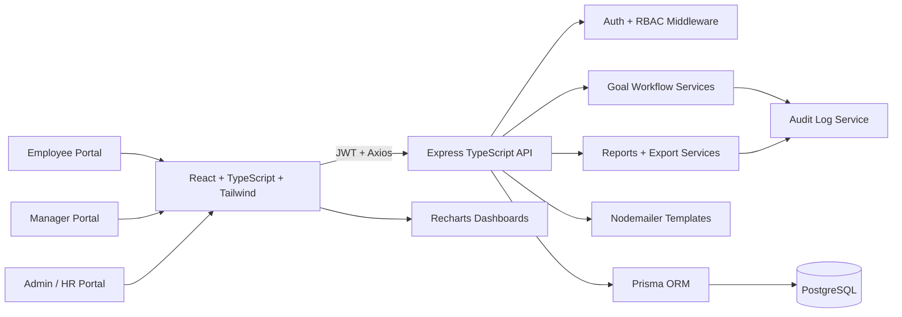

# GoalSync Architecture

## Domain Boundaries

- Auth owns JWT login, refresh tokens, password hashing, and role authorization.
- Goals owns validation rules, approval workflow, shared goals, locking, unlocks, and progress scoring.
- Check-ins owns quarterly window enforcement and achievement updates.
- Reports owns dashboard summaries plus CSV and Excel exports.
- Audit logs record goal edits, approvals, unlocks, target changes, and weightage changes.
